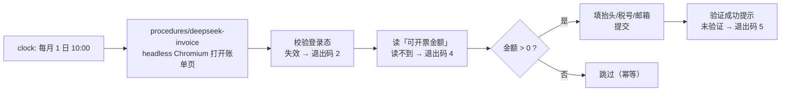

# 流程图 · computer-automation/deepseek-invoice

```mermaid
flowchart LR
  A["clock: 每月 1 日 10:00"] --> B["procedures/deepseek-invoice<br/>headless Chromium 打开账单页"]
  B --> C["校验登录态<br/>失效 → 退出码 2"]
  C --> D["读「可开票金额」<br/>读不到 → 退出码 4"]
  D --> E{"金额 > 0 ?"}
  E -->|"是"| F["填抬头/税号/邮箱<br/>提交"]
  E -->|"否"| G["跳过（幂等）"]
  F --> H["验证成功提示<br/>未验证 → 退出码 5"]
```
