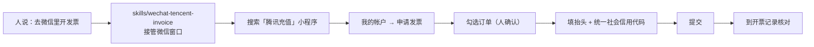

# 流程图 · computer-automation/wechat-tencent-invoice

```mermaid
flowchart LR
  A["人说：去微信里开发票"] --> B["skills/wechat-tencent-invoice<br/>接管微信窗口"]
  B --> C["搜索「腾讯充值」小程序"]
  C --> D["我的帐户 → 申请发票"]
  D --> E["勾选订单（人确认）"]
  E --> F["填抬头 + 统一社会信用代码"]
  F --> G["提交"]
  G --> H["到开票记录核对"]
```
