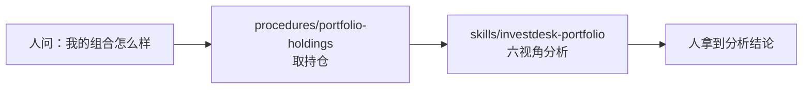

# 流程图 · investdesk/portfolio

```mermaid
flowchart LR
  A["人问：我的组合怎么样"] --> B["procedures/portfolio-holdings<br/>取持仓"]
  B --> C["skills/investdesk-portfolio<br/>六视角分析"]
  C --> D["人拿到分析结论"]
```

两条纪律在图上看不出来，但决定了对不对：**今日涨跌**与**累计盈亏**是两个口径，
不许混；**只给「值得复核」，不给买卖指令**。
