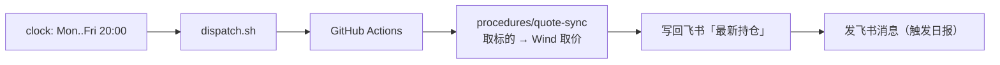

# 流程图 · quote-sync

```mermaid
flowchart LR
  A["clock: Mon..Fri 20:00"] --> B["dispatch.sh"]
  B --> C["GitHub Actions"]
  C --> D["procedures/quote-sync<br/>取标的 → Wind 取价"]
  D --> E["写回飞书「最新持仓」"]
  E --> F["发飞书消息（触发日报）"]
```
