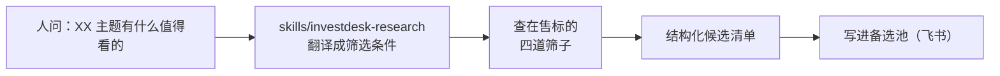

# 流程图 · investdesk/research

```mermaid
flowchart LR
  A["人问：XX 主题有什么值得看的"] --> B["skills/investdesk-research<br/>翻译成筛选条件"]
  B --> C["查在售标的<br/>四道筛子"]
  C --> D["结构化候选清单"]
  D --> E["写进备选池（飞书）"]
```
