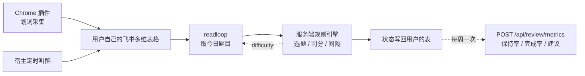

# 流程图 · readloop-daily-self-api

```mermaid
flowchart LR
  P["Chrome 插件<br/>划词采集"] --> T["用户自己的飞书多维表格"]
  H["宿主定时叫醒"] --> T
  T --> B["readloop<br/>取今日题目"]
  B --> C["服务端规则引擎<br/>选题 / 判分 / 间隔"]
  C --> D["状态写回用户的表"]
  D -. 每周一次 .-> M["POST /api/review/metrics<br/>保持率 / 完成率 / 建议"]
  C -. difficulty .-> B
```
