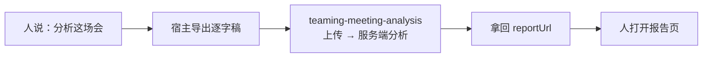

# 流程图 · teaming-meeting-review-self-api

```mermaid
flowchart LR
  A["人说：分析这场会"] --> B["宿主导出逐字稿"]
  B --> C["teaming-meeting-analysis<br/>上传 → 服务端分析"]
  C --> D["拿回 reportUrl"]
  D --> E["人打开报告页"]
```
