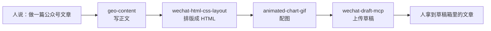

# 流程图 · wechat-article

```mermaid
flowchart LR
  A["人说：做一篇公众号文章"] --> B["geo-content<br/>写正文"]
  B --> C["wechat-html-css-layout<br/>排版成 HTML"]
  C --> D["animated-chart-gif<br/>配图"]
  D --> E["wechat-draft-mcp<br/>上传草稿"]
  E --> F["人拿到草稿箱里的文章"]
```
